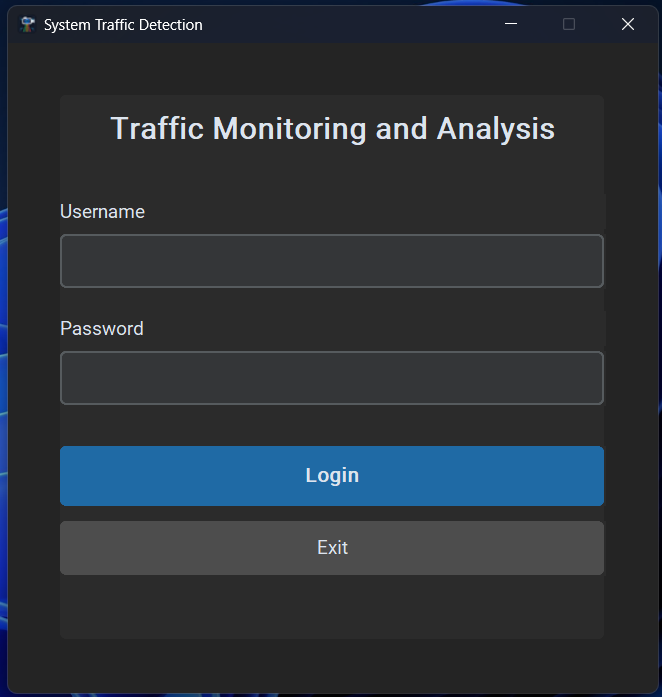
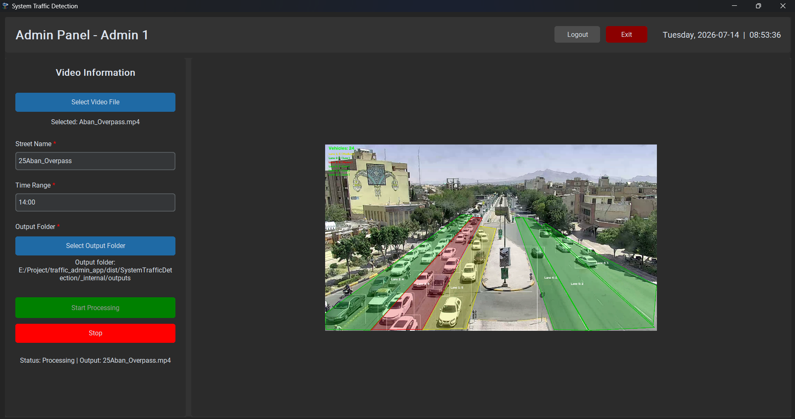
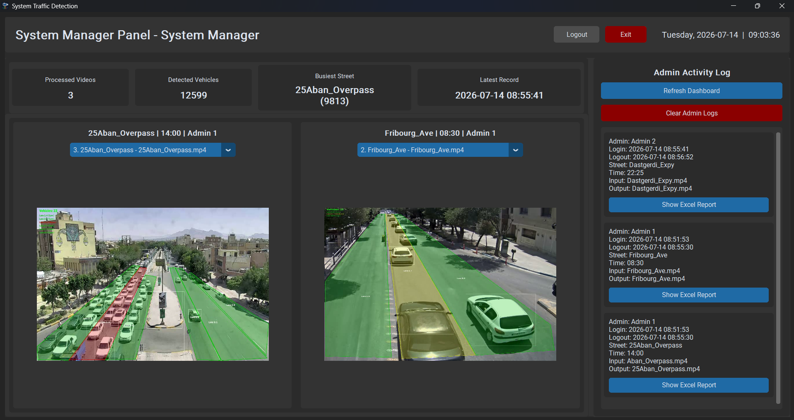

# System Traffic Detection

System Traffic Detection is a desktop application for real-time traffic monitoring and lane-based traffic analysis using computer vision and deep learning.

This project was developed as a bachelor graduation project. The main goal is to detect and analyze traffic directly from video footage without relying on external map services such as Google Maps.

The system uses a custom-trained YOLOv8 model to detect vehicles, count them in each frame, analyze traffic density per lane, generate processed output videos, and create Excel reports.

---

## Project Overview

Many traffic monitoring systems depend on GPS data, mobile network data, physical sensors, or third-party services. These methods can be expensive, infrastructure-dependent, or sometimes inaccurate.

This project provides an independent computer vision-based solution. It processes traffic videos, detects vehicles frame by frame, counts vehicles in predefined lanes, and visualizes traffic density using colored lane overlays.

The application includes two main user roles:

- Admin
- System Manager

Admins process traffic videos and generate results. The system manager reviews processed videos, admin logs, summary statistics, and Excel reports.

---

## Demo Screenshots

### Login Window



### Admin Panel



### System Manager Panel



---

## Key Features

- Vehicle detection using a custom-trained YOLOv8 model
- Real-time frame-by-frame video processing
- Lane-based vehicle counting
- Traffic density visualization with colored lanes
- Admin and system manager login system
- Separate Admin Panel and Manager Panel
- Processed video saving
- Excel report generation
- Admin activity logging
- Dashboard summary for the manager
- Video switching in the manager panel
- Fullscreen desktop interface
- Windows executable build using PyInstaller
- No dependency on Google Maps or external traffic APIs

---

## Traffic Density Logic

Each lane is colored based on the number of detected vehicles:

| Vehicle Count | Traffic Level | Lane Color |
|---|---|---|
| 0 - 4 | Low | Green |
| 5 - 7 | Medium | Yellow |
| More than 7 | Heavy | Red |

---

## Technologies Used

- Python
- OpenCV
- Ultralytics YOLOv8
- CustomTkinter
- NumPy
- Pillow
- JSON
- PyInstaller
- Excel report generation using XLSX/XML structure

---

## Project Structure

```text
traffic_admin_app/
│
├── main.py
├── requirements.txt
├── README.md
├── select_lanes.py
├── SystemTrafficDetection.spec
│
├── assets/
│   ├── app_icon.ico
│   └── app_icon.png
│
├── core/
│   ├── auth.py
│   ├── admin_log.py
│   ├── report_writer.py
│   └── traffic_system.py
│
├── gui/
│   ├── common.py
│   ├── login_window.py
│   ├── admin_gui.py
│   └── manager_gui.py
│
├── data/
│   ├── credentials.json
│   └── admin_logins.json
│
├── lanes/
│   └── .gitkeep
│
├── models/
│   └── weights/
│       └── best.pt
│
├── outputs/
│   └── sample processed output video
│
├── Doc_output/
│   └── sample Excel report
│
└── videos/
    └── .gitkeep